class: inverse

```{r setup, include=FALSE}
knitr::opts_chunk$set(echo = FALSE, message = FALSE)
library(shiny)
library(tidyverse)
```

# R packages required

- shiny
- tidyverse
- DT

```{r, eval=FALSE, echo=TRUE}
install.packages("shiny")
```

Installing Shiny will also install another package `{bslib}` which can be used 
to create beautiful user interfaces.   
  

# Shiny cheatsheet  

https://shiny.rstudio.com/images/shiny-cheatsheet.pdf  

---

class: inverse
background-image: url("images/shiny_cheatsheet.PNG")
background-position: center
background-size: 80%

https://shiny.rstudio.com/images/shiny-cheatsheet.pdf 

---

class: inverse

## Example Shiny app 

A live version of this app can be accessed [here](http://www.bioinformatics.babraham.ac.uk/shiny/Intro_to_Shiny_course/examples/01.1_starwars_app/)

.center[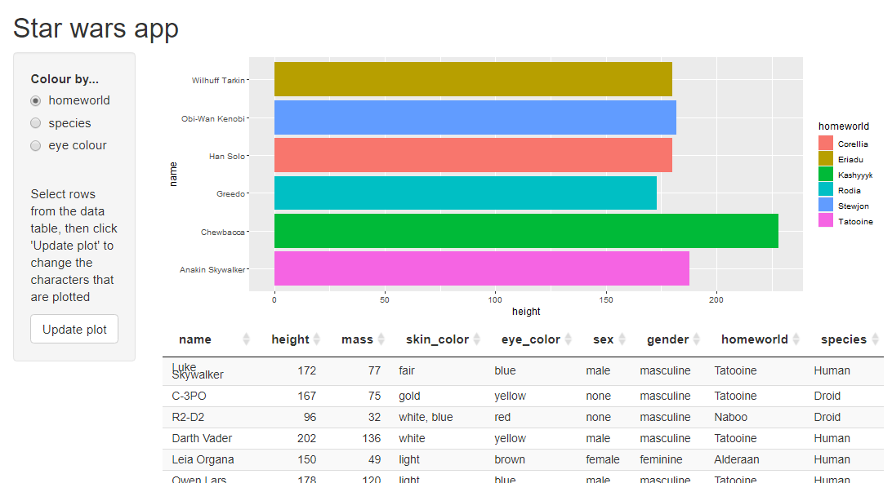]

???
Let’s have a look at a shiny application. This is just a screenshot here, but we 
should be able to get to a live version.  
This is showing some data that comes with base R, so we’ve got a table here of some Starwars characters, and then the plot is showing some of the characters’ heights.  
We can change some things.   
This is fairly limited in what it’s showing but it could be customised further, and hopefully you can see that this kind of thing can be really useful for exploring and presenting data.

---

class: inverse

# RStudio Shiny gallery  
[https://shiny.posit.co/r/gallery/](https://shiny.posit.co/r/gallery/)

.center[]
  
???
There is loads of brilliant info on this website.
Example apps, super simple ones where you can look at the code to undestand how they work,
more complex apps that give you an idea of what can be produced, loads of examples of different features. 
We've just got a short day course to go through some introductory concepts, but there 
is so much cool stuff you can do with this, and this website has got loads of fab info.
    
For now, we're going to look at a really simple app so that we can examine the code needed to produce it.
  
---


class: inverse

# Another example app 
<br>
.center[
  
A live version of this app can be accessed [here](http://www.bioinformatics.babraham.ac.uk/shiny/Intro_to_Shiny_course/examples/01.2_simple_app/)
]

---


class: inverse

<br><br>
.center[]
<br><br>
.pull-left[.center[.h-custom[Web page]]]
.pull-right[.h-custom[Computer running the R session]]


???
What we’ve seen so far are the user interfaces of those 2 apps, or the UI, where the user can interact with the application. The UI is connected to the server. When the user changes options on the web page, the server code reacts and updates the display.  
  
For an app to be running and interactive, there must be a live R session running on a server. The server could be a personal computer or a remote machine.  
In the case of the 2 apps we’ve just seen, they’re running on a web server at Babraham,
but when I created them, I did that on my local machine.
If you’re developing an app locally, the server, the R session would most likely just be running as it usually does on your own machine. I'll run one from my machine a bit 
later on and we can see what that looks like.  

The two parts of the app, the UI and the server, are defined in separate blocks of R code, or even in separate scripts. 

---

class: inverse

# Skeleton Shiny code  
<br>

```{r, eval=FALSE, echo=TRUE}
library(shiny)

ui <- fluidPage(
  
)

server <- function(input, output, session) {
  
}

shinyApp(ui, server)
```

???
This is the basis of all Shiny apps. There are 4 parts.  
  
1. Load the shiny library. 
  
2. The UI code defines the layout of the web page and is run only once, when the app starts. 
  
3. The server code contains functions used in the app including the reactive code – the code that makes Shiny responsive to user input and this code may be run many times while the app is being used.   
  
4. The function to actually create the app.  
  
This code will create a valid Shiny application, it will just be completely blank.

---

class: inverse

# back to the simple app...
<br><br>
.center[]

???
We'll use this app to have a look a the code behind it

---

class: inverse

# Simple app code

```{r, eval=FALSE, echo=TRUE}
library(shiny)

ui <- fluidPage(
  
  titlePanel("Simple app"),
  
  radioButtons(inputId = "letter_choice", 
              label    = "select a letter", 
              choices  = LETTERS[1:5]),
  numericInput(inputId = "number_choice",
               label   = "type in a number",
               value   = 4),
  textOutput(outputId = "message")
)

server <- function(input, output) {
  
  output$message <- renderText({
    paste0("You selected the letter ", input$letter_choice, 
          " and the number ", input$number_choice)
  })
}

shinyApp(ui, server)
```

???
This is all the code to create the simple app on the last slide.  
We'll just have a quick look through it and then we'll look at the parts in more detail.
The first line is loading the shiny package.
Within the UI code we define the layout of the web page and the components of it and this code is run only once, when the app starts.   
Within the server block we have the reactive code – and this may be run many times while the app is being used. When the user changes something, it can trigger the appropriate piece of code to be re-run to update the app.  
Then finally, we have the call to the shinyApp function to actually run the app.
Let’s have a look at the UI code in a little bit more detail.

---
class: inverse

# UI code
.left30-column[
<br>

]

.right70-column[
```{r, eval=FALSE, echo=TRUE}
ui <- fluidPage(
  
  titlePanel("Simple app"),
  
  radioButtons(inputId = "letter_choice", 
              label    = "select a letter", 
              choices  = LETTERS[1:5]),
  
  numericInput(inputId = "number_choice",
               label   = "type in a number",
               value   = 4),
  
  textOutput(outputId = "message")
)

```
]

???
We almost always start the UI code by calling the function fluidPage(), there are fixedPage and fillPage options, but fluidPage is most often used as it allows the application windows to be resized much more easily.  
So fluidPage is a shiny function, and to that we pass the elements that we want to be displayed in the app. We’ll go through the components in more detail later, but let’s have a quick look now.  
Each of these functions is Shiny specific, and they set out what appears where in the app. The functions can be looked up in the R help just as you would with other functions, 
### titlePanel  
The first component is a titlePanel and that can just take a piece of text and essentially makes it large and tags it as the title. That one is very simple.
### radioButtons
Then we’ve got 2 user inputs, the first is a set of radio buttons, this needs a few more arguments than the title panel. It needs an input id, this doesn’t show up on the UI, but we need it later on in the server code, then we’ve got a label, so that’s the piece of text that we see just above the radio buttons, and then we have the choices that are displayed. In this case, I’ve used the built in dataset LETTERS that comes with R, and just selected the first 5 letters of the alphabet.
### numericInput
So that’s the radioButtons. We’ve then got another component that takes in user input, this time it’s a numeric input. The arguments are similar, we need an inputId, the label appears just above the input field, and then a starting value is required.
### output
Finally, we have an output field, there’s not a lot of code here in the UI section for that, we need to assign an output ID this time, and then essentially we’re setting a placeholder to say that is where we want the message to go, and then the construction of the message is dealt with in the server code.   
We’ll look at the server code shortly, but first we’re going to look at some of the properties of inputs.

---

class: inverse

# Inputs

```{r, eval=FALSE, echo=TRUE}
ui <- fluidPage(  
  radioButtons(inputId = "letter_choice", label = "choose a letter", ...),
  numericInput(inputId = "number_choice", label = "", ...)
)
server <- function(input, output) {
  ...
}  
```

Inputs are defined in the UI code.

???
Inputs are defined in the UI code.
For this app, the inputs are the radioButtons and the numericInput. Most of the types of inputs provided in Shiny have the word “input” in their name, radioButtons is just one of the few that don’t, but hopefully it’s fairly obvious that radioButtons can take user input.   
  
--

All inputs require a unique inputId. This gets added to the input object.

???
When you use one of the input functions, in this case radioButtons and numericInput, the IDs get added to the input object. Shiny takes care of this.

--

The input object is a special type of named list (a reactiveValues object).

--

The input object is passed to the server function and the values of the inputs can be accessed and used in the server code.

--

The input object is read-only

---

class: inverse

### Define inputs in the UI

```{r, eval=FALSE, echo=TRUE}
ui <- fluidPage(  
  radioButtons(inputId = "letter_choice", ...),
  numericInput(inputId = "number_choice", ...)
)
```

--

### Access input values from the server code
```{r, echo = FALSE}
input <- list(letter_choice = "C", number_choice = 4)
```

.pull-left[
```{r, echo = TRUE}
input$letter_choice
input[["letter_choice"]]
```
]

.pull-right[
```{r, echo = TRUE}
input$number_choice
input[["number_choice"]]
```
]

???
Accessing the input values. We’ve said that the input object is essentially a named list, and for this application, there are 2 elements in the list, one is called letter choice and the other is called number choice.  
  
If I can access the value of letter choice, that will tell me which of the 5 letters has been chosen from the radio buttons.  
   
We access the values in the same way that we’d access normal list values. R provides a couple of ways of doing this, $ [[]]. 
  
The input object is always called input. That does not change.
Note that quotes are required when names are assigned in the UI, but not when using the dollar notation in the server code, just as you would when accessing list values.

---

class: inverse

## Server code - accessing and using the input values

```{r, eval=FALSE, echo=TRUE}
server <- function(input, output {
  
  output$message <- renderText({
    
    paste0(
      "You selected the letter ", 
      input$letter_choice, #<<
      " and the number ", 
      input$number_choice #<<
    )
  })
}
```

???
So we’ve said that we access the input values from within the server code, so let’s have a look at how that’s done in this app.  
I’m going to talk about outputs more in just a moment, so we won’t worry too much about this line of code, but essentially we can access the input values from within this renderText function, and this creates the output message, so what is going on here is just pasting together some pieces of text. When the values of those inputs change, this code re-runs and the app gets updated.

---

class: inverse

# Outputs

```{r, eval=FALSE, echo=TRUE}
ui <- fluidPage(  
  ...,
  textOutput(outputId = "message")
)
```

???
Let's have a look at outputs in more detail now.

--

Plots/tables/text that can change according to user actions

???
Outputs can be plots or tables or pieces of text that can change and be updated according to user actions. 

--

Initiated in the UI code and must contain a unique ID

???
Similarly to inputs, outputs are initiated in the UI code and must contain an ID.

--

UI code functions as a placeholder

???
Inputs are defined in the ui, they are generally set up there, e.g. for radioButtons, we had to supply an ID, a label and the choices available to the user.    

For outputs, it’s more of a placeholder that is defined in the UI, there’s not generally a huge amount of info in the UI code.

--

Similar to the input object, output is list-like object named according to the output ID

???
The output object, similar to the input one, is a list-like object named according to the output ID. Where it differs is the output object is used for sending output to the user.

---

class: inverse

# Output in the simple app


```{r, eval=FALSE, echo=TRUE}
ui <- fluidPage(...,
  textOutput(outputId = "message")
)
```

???
Let’s have a look at exactly how it’s used in this application. I wanted this output to just be a piece of text, so I’ve just used the textOutput function to create a placeholder in the UI, and given it the ID “message”.  

--

```{r, eval=FALSE, echo=TRUE}
server <- function(input, output, session) {
  output$message <- renderText({
    paste0("You selected the letter ", input$letter_choice, 
           " and the number ", input$number_choice)
  })
}  
```

???
I’ve said that the output object is a list-like object so we use the dollar notation again in the server code, but for the output, we’re not accessing the values, we’re giving Shiny a recipe to tell it what to show the user. Within the render function are instructions telling Shiny what to show the user. 

The text that I want to be displayed in the message is here – it’s a combination of static text, and reactive values, the input values. In order for the reactive values to be accessed, we need to be within a reactive context, this allows Shiny to do its magic and to update the output when an input changes. This renderText function makes this piece of text reactive, so that it can update when it needs to.
Here we’ve just got a text output, but we’ve seen a couple of other output types already. In the star wars app there was a plot and a table. There are a few other types available too. 

--

<br>
.center[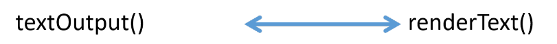]  
  
Output function in UI code pairs with a render function in the server code. 

???
What we need to remember is that when we have an output function in the UI, that always has to be used in conjunction with a render function in the server code.
So in this app, we use the textOutput function in the UI and so needed to use the renderText function in the server code. 

---

class: inverse

# Output and render functions

.center[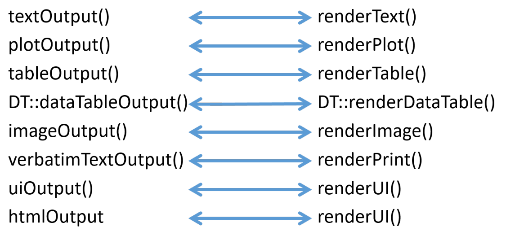]

???
Here we've got more of the paired functions.
If we wanted a plot, we would use the plotOutput function to create a placeholder in the UI, and then we’d need the renderPlot function in the server which would wrap around some plotting code. We’ll have a look at the other types of output a bit later on.

---

class: inverse

# Recap - code for Simple app

.text90[
```{r, eval=FALSE, echo=TRUE}
library(shiny)

ui <- fluidPage(
  
  titlePanel("Simple app"),
  
  radioButtons(inputId = "letter_choice", 
              label    = "select a letter", 
              choices  = LETTERS[1:5]),
  numericInput(inputId = "number_choice",
               label   = "type in a number",
               value   = 4),
  textOutput(outputId = "message")
)

server <- function(input, output) {
  
  output$message <- renderText({
    paste0("You selected the letter ", input$letter_choice, 
          " and the number ", input$number_choice)
  })
}

shinyApp(ui, server)
```
]

???
We’ve gone through this code in quite a lot of detail, this is just a quick reminder of what it looks like altogether.  
Library, UI code where we set out the elements, then in the server code, we can access the input values and use them to create an output message. Then the shinyApp function is called to actually run the app.

---

# Running a shiny application
<br>

```{r, out.width="100%", out.height="100%"}
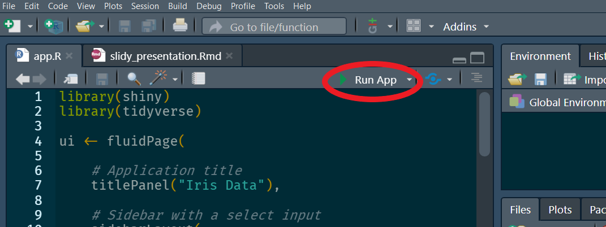 
```

???
I'm going to open up an app and run it in my RStudio session now.
Viewing options – window, pane, external.
  
Creating shiny app from scratch – Geyser template, shinyapp snippet

Shiny apps are generally called app.R, as R recognises this and knows to run it as a Shiny app.   

The name of the app will be the folder name, then within that folder should be a file called app.R. 

The first exercise will involve opening an existing shiny app, which will be called app.R. 

---

# Inserting code snippet
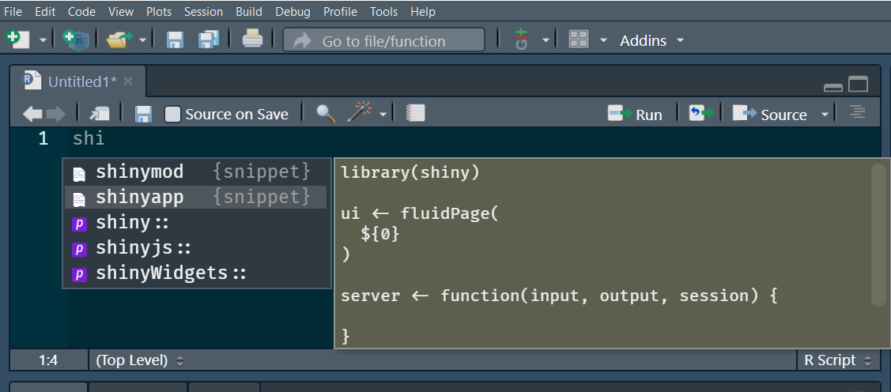 

--

.left-column[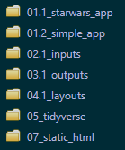]

.right-column[
Save file as app.R within a folder named as the application name.  
Each of these folders contains an app.R file.    
]

---
class: inverse
.exercise-title[Exercise 1]   

.exercise-subtitle[1.1 Modifying an existing application] 
.text80[
<b>a.</b> Open the app.R file for Exercise 1.1 in RStudio and run 
the application.                
<b>b.</b> Complete the tasks set out in the comments at the top of 
the script. These include setting default text, adding a label and changing the step size on the slider.  
]

.exercise-subtitle[1.2 Creating a new Shiny app]  
.text80[
Create a Shiny application from scratch that looks (and functions) 
like the one below.  
]

.left40-column[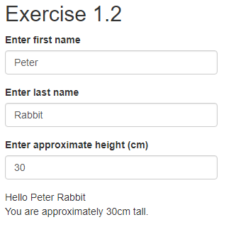]
.right60-column[
.text80[
To get started use the shortcut provided by RStudio - start typing `shinyapp` 
to autofill a shiny code snippet.
- The app should have 2 textInput fields for entering user names, and one numericInput for entering height.    
- The message at the bottom should display the first and last names entered by the user, along with their height.  

Optional
- Add some radio buttons to allow users to select age brackets.
- Change the height selector to a slider.
- Feel free to add extra info fields if you have time.
]]

???
40 mins

---

background-image: url(images/Example2_inputs.png)
class: center, top, inverse
background-size: 60%
class: center, bottom, inverse

<br><br>
Access a live version of this app   [here](http://www.bioinformatics.babraham.ac.uk/shiny/Intro_to_Shiny_course/examples/02.1_inputs/), alongside the code used to create it

???
We’ve seen a couple of different types of inputs, these are all the rest of them. I’ll just quickly run through them, they’re fairly self explanatory. 

This is where a cheatsheet can come in handy, as you may well know what type of input you’re after but remembering the exact name can be tricky 

---

class: inverse

# Outputs - live version [here](http://www.bioinformatics.babraham.ac.uk/shiny/Intro_to_Shiny_course/examples/03.1_outputs/)

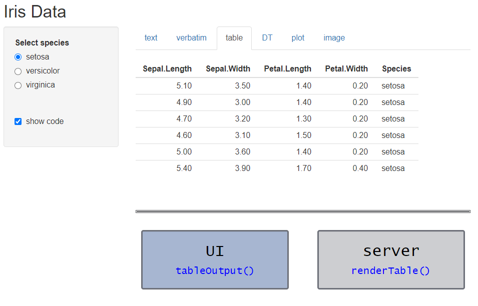

???
Go through these on server

---

class: inverse

# Layouts - UI code
.left30-column[
<br>

]

.right70-column[
.text90[
```{r, eval=FALSE, echo=TRUE}
ui <- fluidPage(
  
  titlePanel("Simple app"),
  
  radioButtons(inputId = "letter_choice", 
              label    = "select a letter", 
              choices  = LETTERS[1:5]),
  
  numericInput(inputId = "number_choice",
               label   = "type in a number",
               value   = 4),
  
  textOutput(outputId = "message")
)

```
]
]

???
The UI code that we've looked at so far has just set one element out after another, 
just like in this simple app.
   
This is fine for a simple app like this, but we may want more control over where we place the different elements, and Shiny provides plenty of options for arranging the layouts.  

---

class: inverse

# Side bar layout 

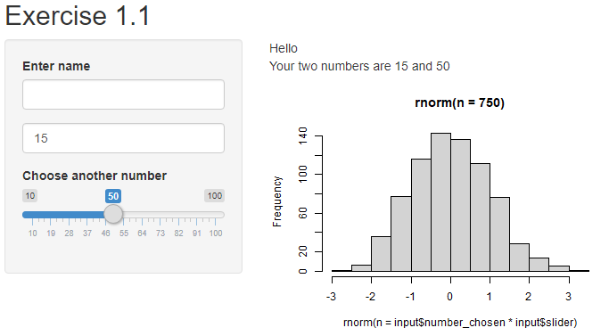

Exercise 1 app on server [here](http://www.bioinformatics.babraham.ac.uk/shiny/Intro_to_Shiny_course/exercises/01.1/)  

???
The first exercise used a sidebarLayout, this is quite a common layout, where the inputs are often in the sidebar and the outputs in the mainPanel, this doesn’t have to be the case but can make it quite nice and neat.   

---

class: inverse

# Side bar layout - syntax

```{r, eval=FALSE, echo=TRUE}
sidebarLayout(
  sidebarPanel,
  mainPanel,
  position = c("left", "right"),
  fluid = TRUE
)

sidebarPanel(..., width = 4)
mainPanel(..., width = 8)
```

---

class: inverse

# Side bar layout - Exercise 1 app code 

.text80[

```{r, eval=FALSE, echo=TRUE}
ui <- fluidPage(
  
  titlePanel("Exercise 1.1"),
  
  sidebarLayout(
    
    sidebarPanel(
      
      textInput(inputId = "user_name", 
                label   = "Enter name"),
      numericInput(inputId = "number_chosen", 
                   label   = NULL, value   = 15),
      sliderInput(inputId = "slider", 
                  label   = "Choose another number",
                  min     = 10, max = 100, value = 50),
    ),
    mainPanel(
      
      textOutput(outputId = "supplied_name"),
      textOutput(outputId = "info"),
      plotOutput(outputId = "density_plot", height = "300px", width = "400px")
    )
  ))
```

]

---

class: inverse

Layout examples - app available [here](http://www.bioinformatics.babraham.ac.uk/shiny/Intro_to_Shiny_course/examples/04.1_layouts/)

.center[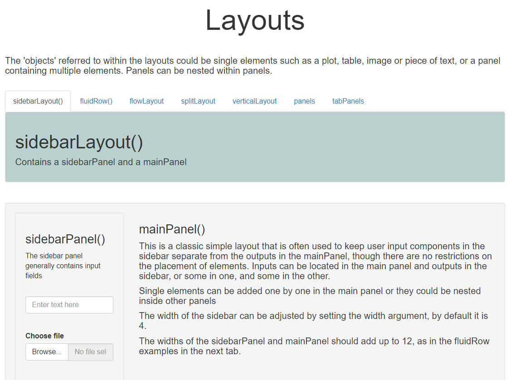]
 
???
Go through layouts on server
 
This is a sidebarlayout like we’ve already seen, the green part at the top is a separate panel with the name of the layout, then underneath we’ve got the actual sidebarLayout.  

There are other layouts available, and a nice thing is that these panels and layouts can be nested within each other to build up a fairly complex design if that is what you are after. It may be that a very simple layout works perfectly for your app, and you don’t need to use any of the other options, but it’s good to know that they’re available.

  
---

class: inverse

.exercise-title[Exercises 2 and 3]

For each exercise open the app.R file and follow the instructions set out in the 
comments at the top of the script.  

.pull-left[
.exercise-subtitle[2. Modifying inputs and outputs]   


]

.pull-right[
.exercise-subtitle[3. Adding a plot and using layouts]  

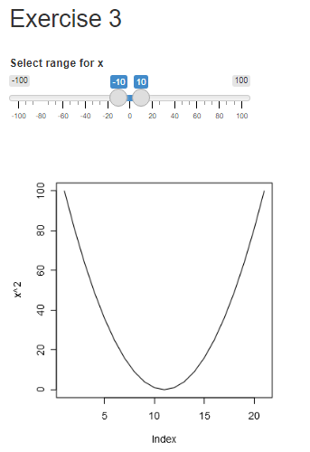
]

??? 
Take 40 mins and have a break

---

class: inverse

# Customising the view of an app

.large-text[HTML] 
```{r, echo=TRUE, eval=FALSE}
titlePanel("Choosing letters")
```

???
A Shiny app is a web application, and if we have a look at its source, we can see a load of html.   

http://www.bioinformatics.babraham.ac.uk/shiny/Intro_to_Shiny_course/examples/04.1_layouts/  

We don’t have to write html to create a Shiny app, the Shiny package does it for us. But the UI code block is essentially creating html. The functions that we've used in the UI code to create titles, inputs and outputs are wrappers to create html elements.

If you've got the shiny package loaded and you enter the text titlePanel(...) into the console, the output you should see is this.

--

```
<h2>Choosing letters</h2>
```

???
HTML elements usually consist of a start and end tag, with the content inserted 
between the two tags.

---

class: inverse

# HTML - inputs 
```{r, eval=FALSE, echo=TRUE}
radioButtons(inputId = "letter_choice", 
             label    = "select a letter", 
             choices  = LETTERS[1:2])
```

???
Some of the Shiny functions do more work than others. This is creating radio buttons so requires more complex html.

--

.text80[

```
<div id="letter_choice" class="form-group shiny-input-radiogroup shiny-input-container">
  <label class="control-label" for="letter_choice">select a letter</label>
  <div class="shiny-options-group">
  <div class="radio">
  <label>
  <input type="radio" name="letter_choice" value="A" checked="checked"/>
  <span>A</span>
  </label>
  </div>
  <div class="radio">
  <label>
  <input type="radio" name="letter_choice" value="B"/>
  <span>B</span>
  </label>
  </div>
  </div>
  </div>
  ```
]

???
Don't need to worry about this, just good to know what Shiny is doing.

---

class: inverse

# HTML - outputs 
  
```{r, eval=FALSE, echo=TRUE}
textOutput(outputId = "message")
```

```
<div id="message" class="shiny-text-output"></div>
```
<br> 

???
Said earlier on that when outputs are defined in the UI code, they are essentially setting placeholders and then in the server code, we tell Shiny what to show there.

--

```{r, eval=FALSE, echo=TRUE}
tableOutput(outputId = "table1")
```

```
<div id="table1" class="shiny-html-output"></div>
```

---

class: inverse

# Static HTML elements

???
Those were dynamic elements that may change depending on the user's actions.
May also want static elements in an app.

--

Shiny provides helper functions for creating the most common
HTML elements. 

--

```{r, eval = FALSE, echo = TRUE}
h1(), h2(), h3(), h4(), h5(), h6() 
```
are functions for turning a piece of text into a title or header, h1 being the 
top level heading, h2 a subheader, h3 the next level subheader etc.   

`h1()` is a helper or wrapper function for generating the `<h1></h1>` html tag.
```{r, eval = FALSE, echo = TRUE}
h1("Simple app")
```
produces the following html:
```
<h1>Simple app</h1>
```
The other header tags (h2 - h6) work in a similar way. 

---

class: inverse

# Other helper functions

.text80[
```{r}
  p(strong("bold"), " text can be created using the ", code("strong()"), " function.")
  p(em("italic"), " text can be created using the ", code("em()"), " function.")
  hr()
  p("The horizontal lines are created using ", code("hr()"), " and line breaks with ", code("br()"))
  hr()
p("Other wrapper functions include:")
  p(code("p()")     , " creates a paragraph (starts on a new line)")
  p(code("a()")     , " insert a link to a web page")
  p(code("div()")   , " create a new section (division) of the HTML. Useful when customising the display with CSS ")
  p(code("span()")  , " Create a group of inline elements. Normally used to style a string of text.")
  p(code("pre()")   , " Create pre-formatted text.")
  p(code("code()")  , " insert text that looks like computer code")
```
]

---

class: inverse
  
# tags$

```{r}
  p("The elements on the previous slide can also be created using the tags list,", 
    code('tags$h1("Header 1")'), " is equivalent to ", code('h1("Header 1")'))
  p(code("tags$"), " is the method of creating tags for the HTML elements that do not have wrapper functions. Shiny supports 110 HTML tags in total. RStudio have provided a glossary of these")
  a("HTML tag glossary", href="https://shiny.rstudio.com/articles/tag-glossary.html")
```

--

<br>

# Further Customisation - Shiny themes

The package [shinythemes](http://rstudio.github.io/shinythemes/?_ga=2.52059049.1233787781.1602844016-794742539.1552037904) provides a range of themes to change the appearance of your Shiny app.

---


class: inverse

# Importing datasets - fileInput()

Unlike other inputs, fileInput() returns a data frame with 4 columns

.left55-column[
```{r, echo = TRUE, eval = FALSE}
ui <- fluidPage(
  
  titlePanel("Uploading files"),
  fileInput(inputId = "upload",  
            label = "Upload...",),
  tableOutput("files")
)
server <- function(input, output) {
  
  output$files <- renderTable(input$upload)
}
```
]

--

.right45-column[
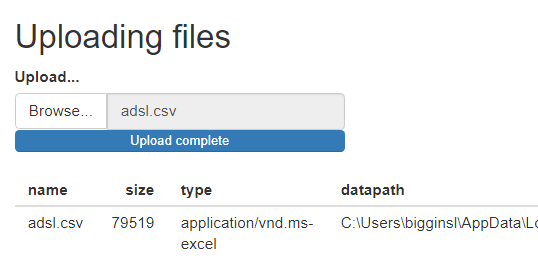]

???
Most inputs return simple vectors, but fileInput() returns a data frame with four columns
  
If we access the input value and put that in a table, we can see that it has 4 columns, name, size, type and datapath.  
---

class: inverse

# Importing datasets - fileInput()

.left60-column[
.text80[        
   
```{r, echo = TRUE, eval = FALSE}
library(shiny)
library(readr)

options(shiny.maxRequestSize = 10 * 1024^2) 

ui <- fluidPage(
  titlePanel("Uploading files"),
  fileInput(inputId = "upload", 
            label = "Upload...",),
  tableOutput("files")
)

server <- function(input, output) {
  
  output$files <- renderTable({
    req(input$upload)
    dataset <- read_csv(input$upload$datapath) #<<
    head(dataset)
  })
}

shinyApp(ui = ui, server = server)
```
]]

???
Here we're accessing the datapath or filepath and using read_csv to import the file.
  
Something else new - req() which is a Shiny function to check whether the argument passed to req is "Truthy" - not false or null or an empty vector.
If it's not Truthy, the rest of the code in that block won't run.  
If we didn't have the call to req(), the app would still work but we'd get a red
error message showing on the app until a file is chosen.
  
Can be a really useful function to get rid of error messages without having to write a load of ifelse statements checking for null values etc.

(0 is considered truthy)
  
so within the renderTable code, we check that a file has been chosen, then it's imported, and then we use head to just show the first few lines of the dataset.

--

.right40-column[
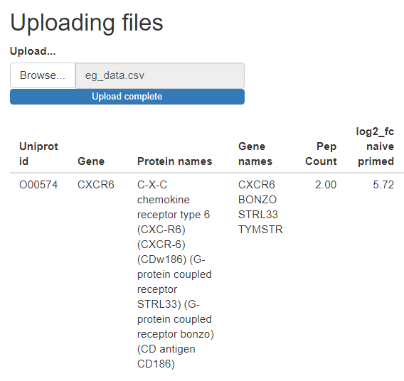


.text80[Default maximum file size is 5MB.]
]

???
The actual app would show more lines of the file, this has just been cut off in the screenshot.

Increase default file upload size using options()

---

class: inverse

# Importing datasets - summary

.large-text[fileInput() returns a data frame of 4 columns]    
.text80[

```{r, echo = TRUE, eval = FALSE, comment = '#'}
input$id$datapath # Access the filepath.
options(shiny.maxRequestSize = 10 * 1024^2) # Increase max upload size (to 10MB).
```
]

--

.large-text[File validity]

.text80[
```{r, echo = TRUE, eval = FALSE, comment = '#'}
fileInput(inputId, label, accept = ".csv")
# Use the accept parameter in fileInput() to limit files shown in browser
```
 
--
 
The accept argument is only a suggestion to the file browser.  
Use further checks to validate file type.

```{r, echo = TRUE, eval = FALSE, comment = '#'}
req(input$file) # Check a file has been chosen.
ext <- tools::file_ext(input$file$name) # get file extension
validate(
  need(ext == "csv", message = "Please upload a csv file")
) # validate extension
read_csv(input$file$datapath)
```

]

???
validate and need are Shiny functions

---

class: inverse

.exercise-title[Exercise 4 - Uploading a file]
.text90[
Create an app that looks like the one below. It should:  
a. Allow a csv file to be chosen and uploaded. Use req() to avoid displaying 
an error message to the user.  
b. Display the first few rows of data in a table.   
c. Have an option to change the number of rows displayed.  

[Optional]  
Use validate() and need() to make sure only csv files are accepted.  
]

.centre80[]

???
20-30 mins

---

class: inverse

# Debugging

???
Run through debugging examples in RStudio.

--

.h-custom[Reading error messages]
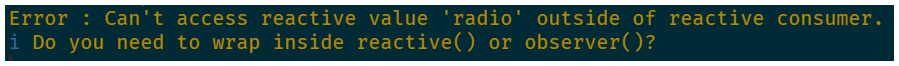 

--

.h-custom[Showcase display mode] 
```{r, echo = TRUE, eval = FALSE}
runApp(…, display.mode = "showcase")
```

--

.h-custom[Breakpoints in server code]  
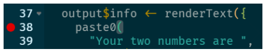

--

.h-custom[Using browser() to interrupt the app]
```{r, echo = TRUE, eval = FALSE}
actionButton("browser", "browser") # in UI code

observeEvent(input$browser, browser()) # in server code
```

---

class: inverse

.exercise-title[Fixing bugs and making modifications]

Open the app.R file for Exercise 5 and follow the instructions set out in the 
comments at the top of the script.  
  
The app will not work initially as there are some bugs in the code.     
  
The first task will be to debug the script to enable the app to work, before making
some further modifications.

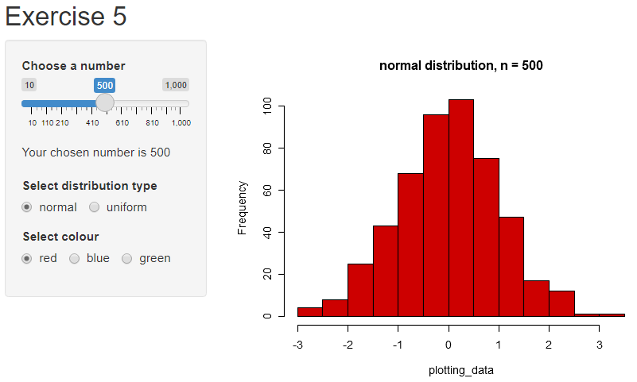

???
20-25 mins

---

class: inverse

# Selecting data with base R and tidyverse

???
Up to now, we've been using user input to alter numeric values, select from some options and report these back to the user.  
We haven't used user input to select columns from a dataset.

--

```{r, echo = TRUE}
head(iris, n = 3)
```

--

```{r, echo = TRUE, eval = FALSE, comment = '#'}
# base R
iris[iris$Sepal.Length > 7 & iris$Petal.Width < 2, ]
```

???
Forget about Shiny for a minute.
This is the syntax used in base R if we want to filter this dataset.

--

```{r, echo = TRUE, comment = '#'}
# tidyverse syntax uses data masking -> minimises repetition
iris %>%
  filter(Sepal.Length > 7 & Petal.Width < 2)
```


---

class: inverse

# Data masking and indirection

???
Data masking is really useful, but it becomes a bit trickier when indirection is introduced, by that we mean not directly typing in the name of the variable,

--

```{r, echo = TRUE}
var1 <- "Sepal.Length"
var2 <- "Petal.Width"
```

???
or column name in this case.

--

```{r, echo = TRUE}
iris %>%
  filter(var1 > 7 & var2 < 2) # doesn't work
```

--

```{r, echo = TRUE}
iris %>%
  filter(var1 > 7) %>% # no error produced but it doesn't do as expected
  head()
```

???
Actually, running this code won't produce an error, but it won't filter the data as expected.
It's actually testing whether the text string "Sepal.Length" > 1, and because of the way that R coerces data types for comparisons, it will return TRUE, and so will return the entire dataset.
Check results are as expected.

---

class: inverse

Use the .data pronoun

```{r, echo = TRUE}
iris %>%
  filter(.data[[var1]] > 7 & .data[[var2]] < 2)
```

--

<br>

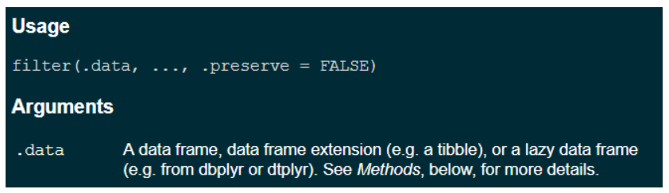

---

class: inverse

# Shiny example
  
```{r, echo = TRUE, eval = FALSE}
iris %>%
    ggplot(aes(x = .data[[input$x_attribute]],
               y = .data[[input$y_attribute]])) +
    geom_point()
```

<br>

--

base R equivalent  

```{r, echo = TRUE, eval = FALSE}
plot(x = iris[[input$x_attribute]],
     y = iris[[input$y_attribute]])
```
  
???
A lot of the really basic example apps use base R graphics as it can be a slightly simpler syntax. 

---

class: inverse

# Tidyverse with Shiny

An example of an app using tidyverse and base R can be found [here](http://www.bioinformatics.babraham.ac.uk/shiny/Intro_to_Shiny_course/examples/06_tidyverse/)

### A code snippet from the app
```{r, echo = TRUE, eval = FALSE}
output$ggplot_iris <- renderPlot({

  iris %>%
    ggplot(aes(x = .data[[input$x_attribute]],
               y = .data[[input$y_attribute]])) +
      geom_point(colour = input$radio_colour) +
      ggtitle(input$plot_name)
})
```


---

background-image: url(images/Exercise6.png)
background-size: contain
class: inverse

---

<br><br><br>
#.center[End of part 1]