class: inverse

```{r setup, include=FALSE}
knitr::opts_chunk$set(echo = FALSE, message = FALSE)
library(shiny)
AZ <- TRUE
```


# Reactivity  

.pull-left[
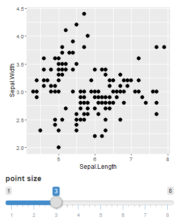
]

.pull-right[
<br><br>

1.  User changes value of the slider.

2.  This is flagged by Shiny.

3.  `output$iris_plot` is notified that it needs to re-run the code.

<br>
.text80[.center[app is on a server [here](https://www.bioinformatics.babraham.ac.uk/shiny/Intro_to_Shiny_course/Part2/examples/0.1_slider/)
]]
]

???
This is an example of a simple application
When the value of the slider is changed, it is flagged, and this notifies output$iris_plot that it needs to re-run the code. 


---

class: inverse

# Reactive sources and endpoints

.left30-column[
<br>
]

.right70-column[
```{r, eval=FALSE, echo=TRUE}
ui <- fluidPage(
  plotOutput(outputId = "iris_plot", ...),
  sliderInput(inputId = "slider", ...) #<<
)

server <- function(input, output, session) {
  output$iris_plot <- renderPlot({ #<<
    ggplot(iris, aes(x = Sepal.Length, y = Sepal.Width)) +
           geom_point(size = input$slider)
  })
}
```


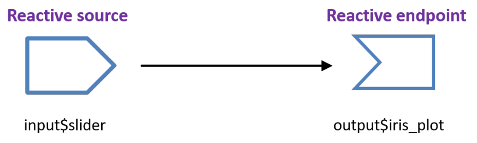

]

???
We can represent this using this sort of diagram where we’ve got the Reactive source, the source of the change, and then we’ve got the endpoint, which is the plot in this case.
This is a very simple example, we’ve only got one source, and one endpoint.

---

class: inverse

<br>
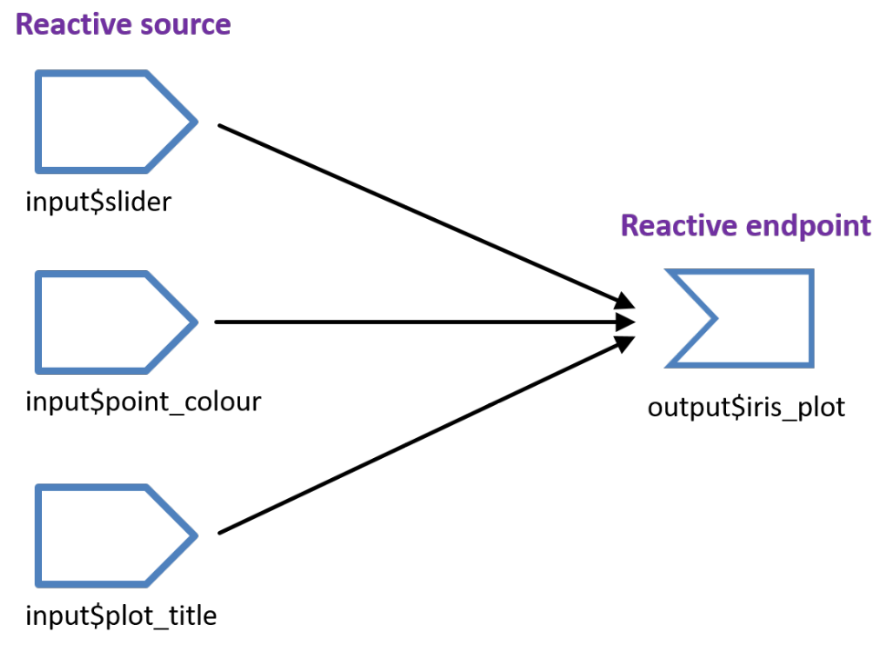

???
Most apps will have multiple sources and endpoints, here we’ve got an example where the user can change 3 different things and these all affect the plot. When any of the inputs change, the code in output$iris_plot is re-run. 

---

class: inverse

# Slow app - on server [here](http://www.bioinformatics.babraham.ac.uk/shiny/Intro_to_Shiny_course/Part2/examples/0.1_slow_app/)

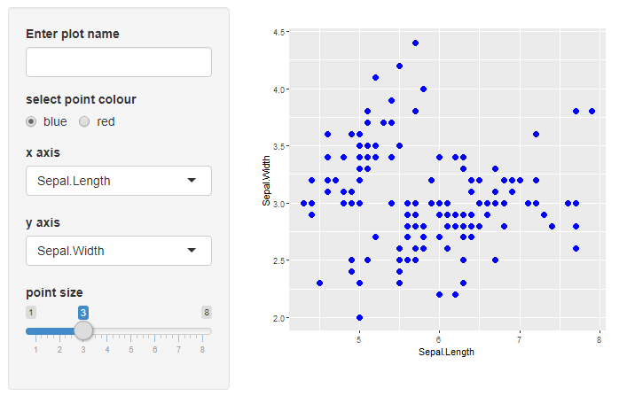

???
Run the slow app on the server.  
This is an application running in showcase mode, and what that means is that we can see the code.   
Hopefully this should all look quite familiar by now, so we’ve got the packages loaded, the data that we’re using, then we’ve got the UI code where we set out all the components of the app. If you recall, this UI code is run once, when the app first starts.   
We’ve then got the server code. The nice thing about showcase mode is that it highlights the code when it runs. It all has to be run to set up the app, so we don’t see that, but when pieces of code are re-run, they are highlighted in yellow.   
So, if we change something…  
You might have noticed that this app is quite slow to update, and the reason that it takes so long is that each time an input is updated, the code within the renderPlot() function runs, and this contains a piece of code that takes a long time to run.  
In this case, I’ve inserted a sleep statement, but in practise this could be a computationally intensive piece of code.  
We’ve got a function here called point_size that is called every time the renderplot code is run. So, a change in any of the inputs will trigger this code to run.

---

class: inverse

# Slow app server code

```{r, eval=FALSE, echo=TRUE}
server <- function(input, output, session) {
  
  output$iris_plot <- renderPlot({
  
    point_size <- function(){
      Sys.sleep(2)
      input$slider + 0.1
    }
  
    iris %>%
      ggplot(aes(x = .data[[input$x_attribute]], 
                 y = .data[[input$y_attribute]])) +
        geom_point(size = point_size(), 
                   colour = input$radio_colour) +
        ggtitle(input$plot_name)
})
  
```

---

class: inverse

# Reactive expressions

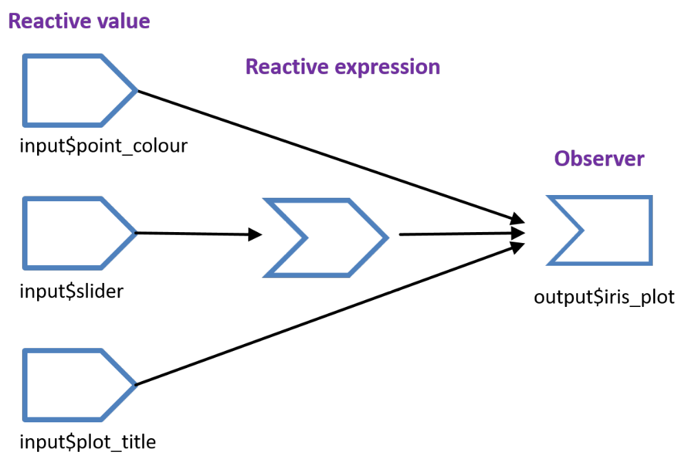

???
To solve this problem...
Shiny provides a special type of function called a reactive expression.  
Reactive expressions can access reactive values or other reactive
expressions and they return a value.  
They can cache values.

---

class: inverse

# reactive() syntax

.left55-column[
```{r, eval=FALSE, echo=TRUE, comment = '#'}
my_reactive_expr <- reactive({
  # code in here
})

my_reactive_expr()
```
]

.right45-column[
<br>
Defining a reactive expression  
<br>
Call it as you would a function
]

???
This is the syntax for creating a reactive expression. It’s a bit like creating a function, so first we assign it a name, then use the word ‘reactive’, and then inside the brackets goes an expression, a piece of code that will be evaluated.  
You call it as you would a function, so the name, and then round brackets. We don’t pass any arguments to a reactive expression so nothing goes inside the brackets.

--

.left55-column[
```{r, eval=FALSE, echo=TRUE}
point_size <- reactive({
  Sys.sleep(2)
  input$slider + 0.1
})
```

```{r, eval=FALSE, echo=TRUE}
point_size()
```
]


???
This is what the actual code looks like for trying to fix the slow app. We’re creating the reactive expression to start with, I’ve called it point_size, it’s still got the slow code within the expression but that’s ok, sometimes that can’t be helped.
Then I can call the reactive expression by typing point_size().

---

class: inverse

# reactive()
.left65-column[
```{r, eval=FALSE, echo=TRUE}
server <- function(input, output, session) {

  point_size <- reactive({
    Sys.sleep(2)
    input$slider + 0.1
  })
  
  output$iris_plot <- renderPlot({
    iris %>%
      ggplot(aes(x = .data[[input$x_attribute]], 
                 y = .data[[input$y_attribute]])) +
        geom_point(size = point_size(), 
                   colour = input$radio_colour) +
        ggtitle(input$plot_name)
})
```
]

???
This is the reactive expression with the rest of the server code. The reactive expression is not inside the renderPlot function like the dodgy function was earlier, it’s a separate entity.  
It is defined here, and it is then called within the renderPlot function. So when any of these reactive values, the inputs, change, they trigger the renderPlot function to run.   

When it gets to the geom_point line, it calls point_size(). One of the great things about reactive expressions is that they cache their values. If the value of input$slider has changed, this reactive expression will have a flag on it (that we can’t see) to say that the code needs to be re-run in order to get the latest update.  
If input$slider hasn’t changed then the existing, cached value of point_size can be used. This means that each time an input value is changed, all the code within renderPlot will run, including the call to point_size(), but the slow code within point_size will only run if input$slider has changed.  


--

.right35-column[
.h-custom[reactive expressions]
-   return a value
-   cache the value
-   are callable
-   are lazy - the code doesn't run until it's called
<br><br><br><br><br><br><br><br>
]

???
More properties of reactive expressions.  
   
They are designed for returning values, their purpose is to evaluate an expression and return a value, it doesn’t need to be a single value, it can be a whole dataset, but it will return the last element as a value.
We’ve said it’s callable, we call it like we would a function.  
   
It’s other important property is that it is lazy, the code doesn’t run until it’s called. If this point_size() reactive expression wasn’t called within the renderPlot function it wouldn’t evaluate. We’ll look more at lazy and eager components a bit later on.

--

.text80[
The reactive expression here is called by a render function.  
Render functions are a special implementation of an observer. They are eager, not lazy and so will re-evaluate the code when a reactive value or expression changes.  
]

???
There are other observers that aren't render functions, observeEvent() and observe().

---

class: inverse

# Faster app - on server [here](http://www.bioinformatics.babraham.ac.uk/shiny/Intro_to_Shiny_course/Part2/examples/0.1_faster_app/)

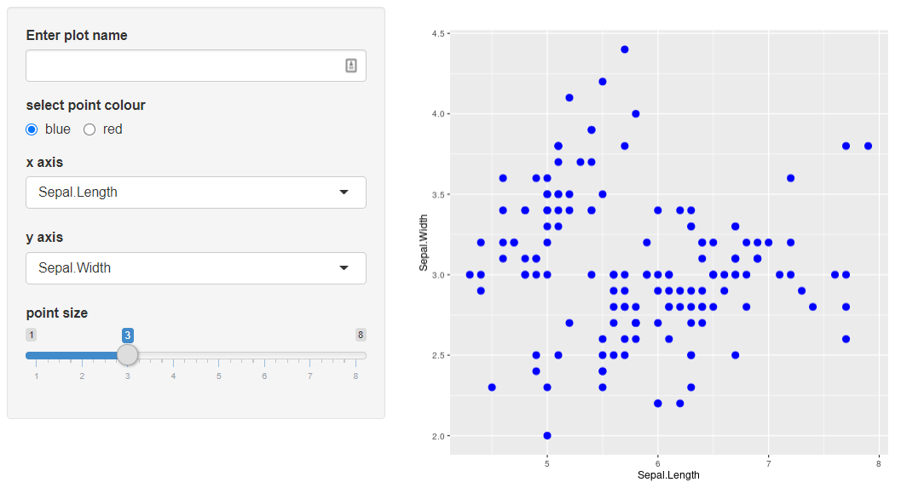

---

class: inverse

# isolate()

--

Wraps around reactive value or expression

```{r, eval = FALSE, echo = TRUE}
isolate(input$text_field)
```

<br> 
The value of `input$text_field` can still be accessed but any
changes in `text_field` will not cause the code to be re-evaluated.

???
Very different shiny function
Isolate wraps around a reactive value or expression and returns a non-reactive copy of the results.

---

class: inverse

# Isolate Examples

.pull-left[
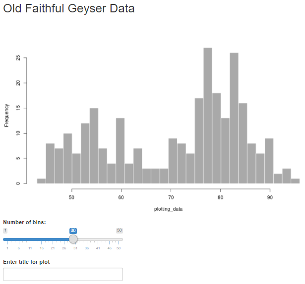
]

.pull-right[
[Example 1](http://www.bioinformatics.babraham.ac.uk/shiny/Intro_to_Shiny_course/Part2/examples/2.1_isolate_title/)  
.text80[Not using `isolate()`, the plotting code is re-run each time a key is pressed in the text field – noticeable if typing the title slowly. Also updates when the slider is moved.]   
  
[Example 2](http://www.bioinformatics.babraham.ac.uk/shiny/Intro_to_Shiny_course/Part2/examples/2.2_isolate_title/)  
.text80[The title only updates when the slider is moved. `input$title_text` has been wrapped in `isolate()` so that it no longer causes the plotting code to rerun]
  
[Example 3](http://www.bioinformatics.babraham.ac.uk/shiny/Intro_to_Shiny_course/Part2/examples/2.3_isolate_title/)  
.text80[An `actionButton` has been added so the title now updates when the slider is moved or when the button is pressed.]
]

???
2.1 – The plotting code is re-run each time a key is pressed in the text field (or the slider moves) – noticeable if typing the new title slowly.

2.2 - The title only updates when the slider is moved. The plotting code only reruns when the slider is moved.   
  
2.3 - The plotting code is rerun each time the slider is moved or the 'Update title‘ button is pressed.

(2.4 same as 2.3 but doesn’t have the renderText() function showing the value of the button)


---

class: inverse

# reactive and isolate recap


.pull-left[
.h-custom[reactive()]  

Call a reactive expression as you would a function

<br><br>

.h-custom[isolate()]

Wrap an input value or reactive() in isolate() to stop it causing
code to be re-evaluated when the value changes.
]


.pull-right[
```{r, eval=FALSE, echo=TRUE}
point_size <- reactive({
  Sys.sleep(2)
  input$slider + 0.1
})

point_size()
```

<br><br>

```{r, eval=FALSE, echo=TRUE}
isolate(input$slider)  

isolate(point_size())
```
]

???
Quick recap of the syntax of reactive and isolate and then the first couple of exercises.

---

class: inverse

# Exercises 1 and 2

For each exercise open the app.R file and follow the instructions set
out in the comments at the top of the script.

.pull-left[
.exercise-title[1 Using a reactive expression]
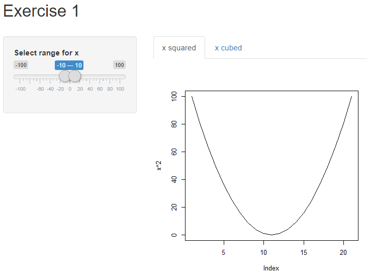
]

.pull-right[
.exercise-title[2 Using reactive() and isolate()] 

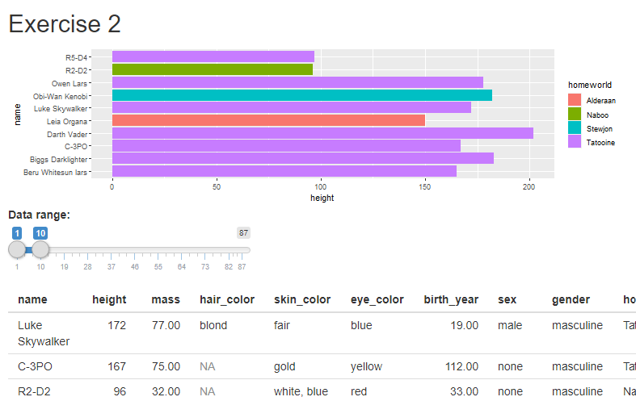
]

---

class: inverse

# Reactive expressions and observers

???
We’ve seen reactive expressions, and we’ve seen render functions. Render functions are a special type of observer, but there are other observers as well, there is observeEvent and the more generic observe(). Observers behave very differently to reactive expressions. 

--

Both store expressions that can be executed.

--

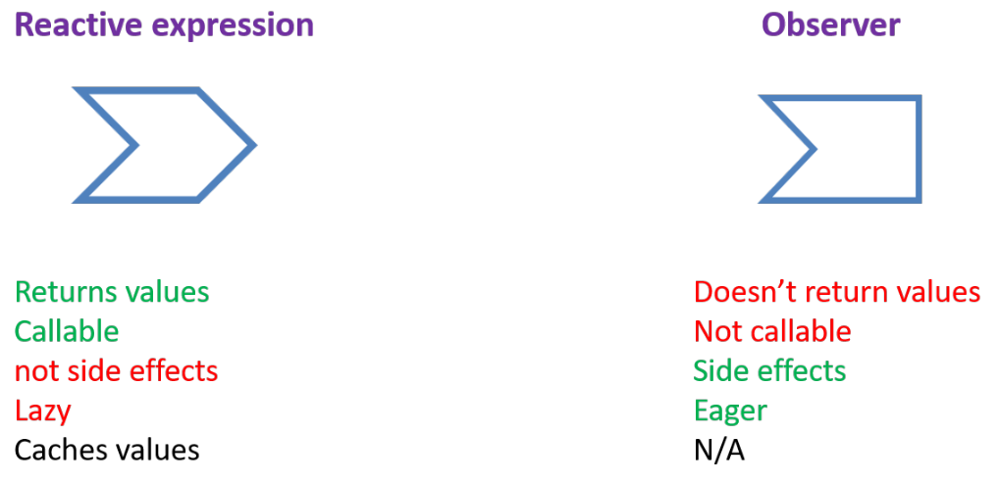
???
Reactive expressions return values, are callable.  
They shouldn’t create side effects. So, the aim of a reactive expression is to evaluate the expression and return a value, it shouldn’t modify other variables in the environment.  
Observers are in many ways complete opposites of reactive expressions, they do not return values, they are not callable, they just run when they need to, they are supposed to create side effects, so they can alter variables in the environment.   
And observers are eager, they’ll run as soon as one of their dependencies is invalidated.

--

.text90[
Reactive expresssions need an observer as a descendent in order to execute.  
  
reactive() -- calculating values without side effects  
observe() -- performing actions with side effects
]

???  
Aim of a reactive expression is to calculating values without side effects
Aim of an observer is to perform actions with side effects  
---

class: inverse

# Chick app

.left40-column[
Examples of:  
- lazy vs eager 
- reactlog
- observeEvent() 
<br><br><br>
]

.right60-column[
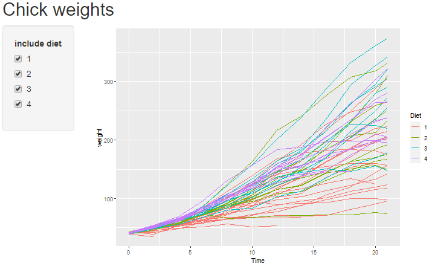
]

---

class: inverse

# Reactlog

.text80[
To view a reactlog graph, the `reactlog` package must be installed and the following line inserted in the app.R script after the packages have been loaded.
]

```{r, eval = FALSE, echo = TRUE}
options(shiny.reactlog = TRUE)
```

.text80[
Then, run the app in a browser
and press Ctrl+F3 (Command + F3 for Macs) in the browser to launch the visualisation.
]

.center[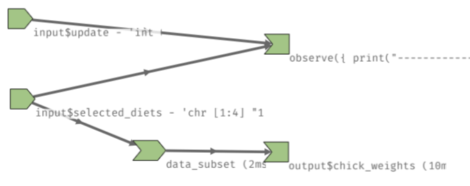]

---

class: inverse

# Observe functions

.h-custom[observeEvent()]
.left35-column[
.text80[
Code will evaluate when reactive values in first argument change, i.e. only when 
`input$update` changes.
]  
]  

.right65-column[

```{r, eval=FALSE, echo=TRUE}
observeEvent(input$update, {
  print(paste0("button count = ", input$update))
  print(paste0(length(input$selected_diets), 
               " diets are currently selected"))
})
```
]  


.left35-column[
<br><br>
.h-custom[.greyed-out[observe()]]
.text80[
.greyed-out[
The code block will evaluate when any of the 
reactives change.   
This should be used with caution to avoid inefficiencies.
]
]
]

.right65-column[
<br>
.greyed-out[
```
observe({
  print(paste0("button count = ", input$update))
  print(paste0(length(input$selected_diets),
               " diets are currently selected"))
})
```
]
]

---

class: inverse

# Reactive expressions

.left35-column[
.h-custom[reactive()]    

.text90[Reactive expression]
]  
.right65-column[
```{r, eval=FALSE, echo=TRUE}
data_subset <- reactive({
  ChickWeight %>%
    filter(Diet %in% input$selected_diets)
})
```
]


.left35-column[
<br>
.h-custom[.greyed-out[eventReactive()]]
.greyed-out[
.text90[Reactive expression that is only evaluated when reactive value in first argument 
is invalidated]
]
]
.right65-column[
<br>
<br>
.greyed-out[
```
data_subset <- eventReactive(input$update, {
  
  ChickWeight %>%
    filter(Diet %in% input$selected_diets)
})
```
]
]

---

class: inverse

# Reactive values

.left35-column[
.h-custom[reactiveVal()]   
.text90[Single reactive value that can be set and updated]  
<br>  
.h-custom[reactiveValues()]
.text90[A list of reactive values that can be set and updated (the input object
is a reactiveValues object)]
]

.right65-column[
```{r, eval=FALSE, echo=TRUE, comment="#"}
rv <- reactiveVal(25)
rv(30) # to modify value from an observer
rv()   # to access value
```

<br><br>    
   
```{r, eval=FALSE, echo=TRUE}
my_rv <- reactiveValues(x = 5, y = 10)

my_rv$x <- 7   # to modify value from an observer
my_rv$y <- 20

my_rv$x   # to access value
```
]
  
???
This is the last type of reactive functions that we’re going to look at.  

Reactive values are quite different to reactive expressions. They allow values to be created that can be updated as and when necessary. They are generally modified from observers.   

There are 2 different functions here, reactiveVal() for creating a single reactive value and reactiveValues, and unfortunately they have quite different syntaxes.  

Reactive values are particularly useful when you want to change a value from multiple sources. We’ll have a look at an example app.

---

class: inverse

# Reactive values examples

.left60-column[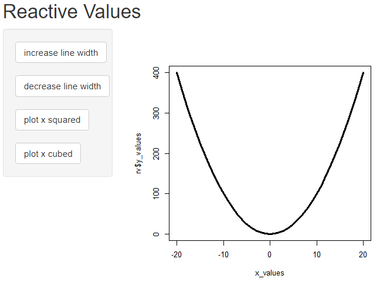]

.right40-column[
.h-custom[
[Reactive values app link](http://www.bioinformatics.babraham.ac.uk/shiny/Intro_to_Shiny_course/Part2/examples/3.1_reactiveValues/)
  
[Reactive val app link](http://www.bioinformatics.babraham.ac.uk/shiny/Intro_to_Shiny_course/Part2/examples/3.2_reactiveVal/)  
]
]

---

class: inverse

.pull-left-minborder[
.h-custom[reactiveVal()]
```{r, eval = FALSE, echo = TRUE}
x_values <- -20:20
server <- function(input, output) {
  
  line_width <- reactiveVal(3)
  y_values <- reactiveVal(x_values)
   
     
  observeEvent(input$lwd_increase, {
    line_width(line_width()*1.5)
  })    
  observeEvent(input$lwd_decrease, {
    line_width(line_width()/1.5)
  })
  observeEvent(input$plot_x_squared, {
    y_values(x_values^2)
  })
  observeEvent(input$plot_x_cubed, {
    y_values(x_values^3)
  })
  output$x_plot <- renderPlot({
    plot(x_values, 
         y_values(), 
         type = "l", 
         lwd = line_width())
  })    
}
```
]

.pull-right-minborder[
.h-custom[reactiveValues()]
```{r, eval = FALSE, echo = TRUE}
x_values <- -20:20
server <- function(input, output) {
  rv <- reactiveValues(
    line_width = 3,
    y_values   = x_values^2
  )
  observeEvent(input$lwd_increase, {
    rv$line_width <- rv$line_width*1.5
  })    
  observeEvent(input$lwd_decrease, {
    rv$line_width <- rv$line_width/1.5
  })
  observeEvent(input$plot_x_squared, {
    rv$y_values <- x_values^2
  })
  observeEvent(input$plot_x_cubed, {
    rv$y_values <- x_values^3
  })
  output$x_plot <- renderPlot({
    plot(x_values, 
         rv$y_values, 
         type = "l", 
         lwd = rv$line_width)
  })    
}
```
]

---

class: inverse

# Syntax recap

.left35-column[
.h-custom[reactive()]   
.text90[Reactive expression]
<br>  
<br>  
<br>    
.h-custom[eventReactive()] 
.text90[Reactive expression that is only evaluated when reactive value in first argument is invalidated.]
]

.right65-column[
```{r, eval=FALSE, echo=TRUE}
data_subset <- reactive({
  # code here that produces a return value
  ChickWeight %>%
    filter(Diet %in% input$selected_diets)
})
data_subset() # call it as you would a function
```
  
<br>  
```{r, eval = FALSE, echo = TRUE}
data_subset <- eventReactive(input$update, {
  # code here that produces a return value
  ChickWeight %>%
    filter(Diet %in% input$selected_diets)
})
data_subset() # call it as you would a function
```
]

???
You probably won’t need to use all these functions.  

reactive(), observeEvent() and render functions will probably be sufficient for the majority of your code.   
  
Depending on what your app does you may not need more than those functions, but it's good to know that other functions exist. When we're illustrating the use of these functions in fairly simple apps, it can be difficult to see why you'd want to use these functions over other ones. I think that a lot of this comes down to experience and actually writing your own apps. It may be that you suddenly realise that one of these other functions would work perfectly in your code.

---

class: inverse

# Syntax recap

.left35-column[
.h-custom[reactiveVal()]  
.text90[Single reactive value that can be set and updated]

<br>
.h-custom[reactiveValues()]  
.text90[A list of reactive values that can be set and updated]

<br><br>  
.h-custom[isolate()]  
.text90[wrap around a reactive value or expression to return a non-reactive copy]
]

.right65-column[
```{r, eval=FALSE, echo=TRUE, comment='#'}
rv <- reactiveVal(25) # create
rv(30) # set (usually from observer)
rv()   # get
```
<br>  
  
```{r, eval=FALSE, echo=TRUE, comment='#'}
my_rv <- reactiveValues(x = 5, y = 10) # create
my_rv$x <- 7   # set (usually from observer)
my_rv$y <- 20  # set (usually from observer)
my_rv$x        # get
```

<br><br>
```{r, eval = FALSE, echo = TRUE}
isolate(input$var)
```

]

---

class: inverse

# Syntax recap

.left35-column[
.h-custom[
observeEvent()  
  
<br>  
observe()    
]    
]

.right65-column[
```{r, eval = FALSE, echo = TRUE, comment='#'}
observeEvent(input$slider, {
  # this code will execute when input$slider 
  # changes, does not return a value
})
```
  
  
```{r, eval=FALSE, echo=TRUE, comment='#'}
observe({
  # this code will execute when any reactive 
  # values or expressions within it change, 
  # does not return a value
})
```
]  

---

class: inverse

# Reactive expressions and observers

Both store expressions that can be executed.


Reactive expressions need an observer as a descendent in order to
execute.

reactive() -- calculating values without side effects  
observe() -- performing actions with side effects

???
We’ve already seen this slide but it is really quite important.
The reason I’ve gone on quite a bit about the properties of observers vs reactive expressions, is that you can get away with doing things in reactive expressions that you shouldn’t, creating side effects, modifying other variables, and your code may work until some particular combination of events and then it will break, so it’s worth getting to grips with how reactivity works in Shiny, especially if you’re developing more complex apps. There are some links to some articles at the end of this slide show.

---

class: inverse

# Updating UI components

UI inputs may need to be updated after user actions. There are a set of update
functions available.

`update[inputType]`

      
```{r, eval = FALSE, echo = TRUE}
updateSelectInput(session, id, choices = c("x", "y", "z"))
updateSliderInput(session, id, min = 10, max = 50, step = 5)
```

???
Last little bit of content...  

So far, we’ve just set up the inputs in the UI code and that’s been fine. Sometimes UI inputs may need to be updated after user actions, a set of values on a slider may need to be updated, or in the case of exercise 6, the selectInput needs to be updated depending on the file chosen.
There are a set of update functions available, and you can look these up just as you would other R functions to check what arguments are required.

--

# Deploying a shiny app 

- Develop locally, deploy when ready
- A Shiny server - make sure required packages are installed on the server
- shinyapps.io https://www.shinyapps.io/ 

???
If you have access to a shiny server then, when your app is ready, you can just copy it over to the server, you just need to make sure that any packages that your app uses, are installed on the server.

---

class: inverse

# Exercises 3 and 4

For each exercise open the app.R file and follow the instructions set out in the 
comments at the top of the script.

.pull-left[
.exercise-title[Using eventReactive()]
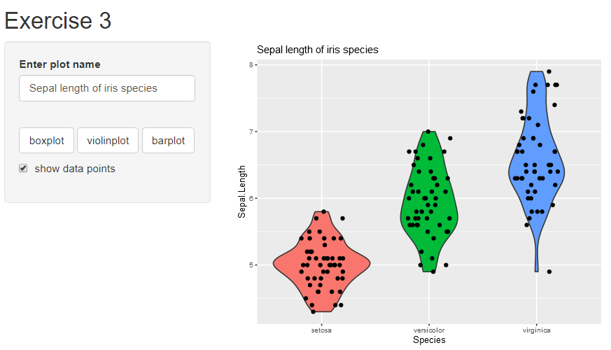
]

.pull-right[
.exercise-title[Exercise 4]
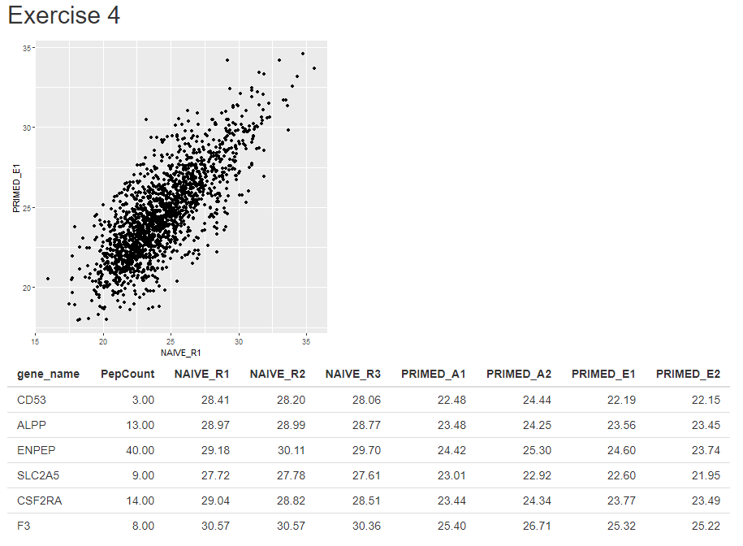
]  

???
Exercise 3 goes back to the app from Exercise 2 and uses eventReactive instead of isolate.

```{r, eval=!AZ} 
 knitr::knit_exit()
```

---

class: inverse

.exercise-title[Exercise 5]

.text90[Create an app that looks like this one. It should:

1. Import the advs.csv dataset.    
2. Provide drop down lists of variables to plot on x and y axes.  
3. Filter data based on the selected subject and parameter.  

]

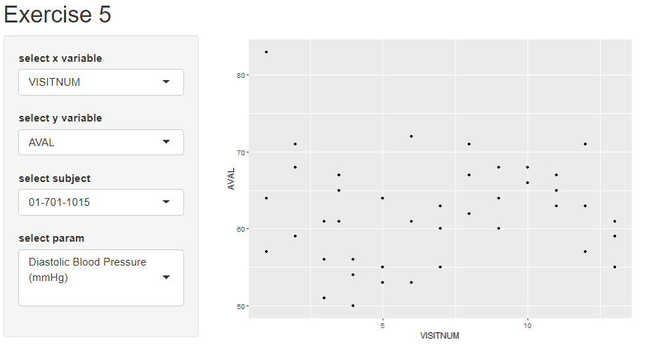

---

class: inverse

# Exercise 6
.pull-left[
.text90[
Create an app that looks like this one and allows the user to:

1. Upload any of the 3 supplied datasets.  
2. Provide a drop down list of variables to select from.  
3. Show some summary statistics for the selected variable.  

.text80[
The data files contain slightly different column names so you'll need to use 
`updateSelectInput()` to update the list of available variables.   

The stats shown in this app are from the `stat.desc()` function in the package pastecs. You can provide some less extensive summary stats if you prefer.
]
]
]

.pull-right[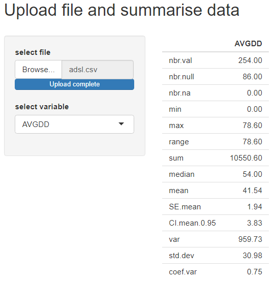]

---

class: inverse

# Resources

<https://shiny.rstudio.com/articles/understanding-reactivity.html>

<https://mastering-shiny.org/> early online version of book by Hadley
Wickham

<https://resources.rstudio.com/shiny-developer-conference/shinydevcon-reactivity-joecheng-part-1-1080p>
Talk by Joe Cheng about reactivity

